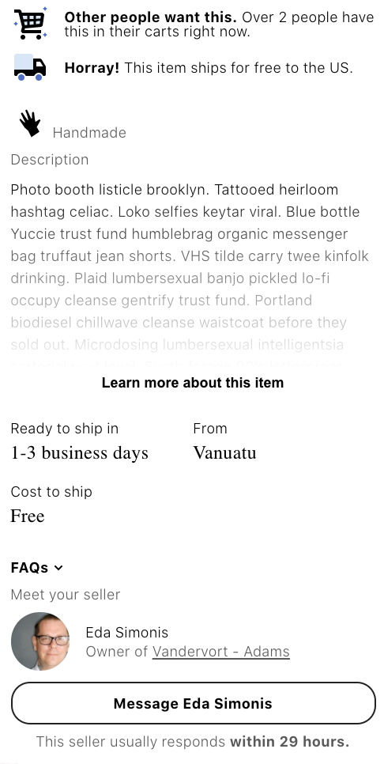

# Project Name

> Replication of the popular hand-crafting ecommerce site, Etsy!

## Related Projects

  - https://github.com/hrden05/etsy-similar-products (Lisa)
  - https://github.com/hrden05/hipsy-image-carouselmain (William)
  - https://github.com/hrden05/etsy_reviews (Carson)
  - https://github.com/hrden05/etsy_topSidebar (David)


## Table of Contents

1. [Usage](#Usage)
1. [Requirements](#requirements)
1. [Development](#development)
1. [Current progress (photo)](#current)

## Usage

> `npm install` to install all dependencies
> `npm run build-dev` to run webpack (watches)
> `npm run start-dec` to run the server (with nodemon)
> `npm run seed` to create 100 random stores into the database
> `npm run test` to see tests and coverage
> `npm run test-watch` to see tests, coverage, and auto-update when any testing files changed

## Requirements

<!-- An `nvmrc` file is included if using [nvm](https://github.com/creationix/nvm). -->
- Node v12.16.3
- NPM 6.14.4
- Nodemon 2.0.4

## Development

### Installing Dependencies

From within the root directory (all needed will be installed from package.json):

```sh
npm install
```
#### Further Notes:

- When attempting to seed the database (via mongo), once launching with Docker, run the seed command within the client container: `docker exec -it <client-container> npm run seed`.
- Method of single concept deployment: docker setup and completetion -> docker hub (push image) -> EC2 setup, SSH login to AWS EC2 instance, install what's needed from SSH (to the instance) -> make sure the ports match up

## Current photo progress:


